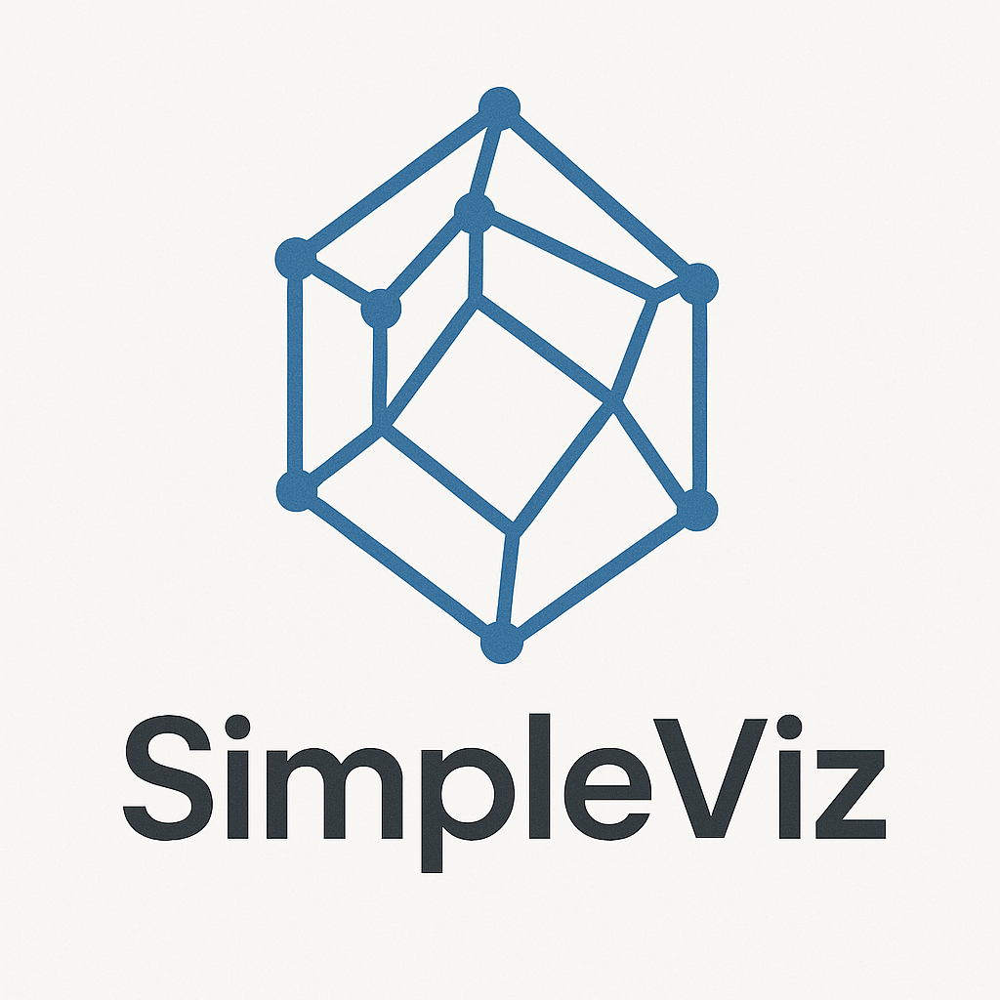

Light-wight browser-based visualisation of POSCAR files with on-device rendering. 

### Current Features:

- Fully running in browser with mobile device and touch support
- Automatic periodice boundary conditions
- Automatic visualisation of bonds with customisable bond min lenght values
- Inter-atomic distance measuring
- Angle measurements 🔥

### Features We Could Add  
 
1. Switch for Parallel vs. Perspective View
2. Lighter shadow rendering
3. Checkbox to select and deselect individual bonds &#x2705;
4. Minimum bond lenght slider (?)
5. Reset button for bond lengths, fix 0 bond length &#x2705;
6. Keep distance measurements (last 3 or something) until clear &#x2705;
7. VESTA colors or some other nice map &#x2705;
8. Checkbox for "activating measuring" to be more touch compatible; so measuring is not enabled by default but needs a button click &#x2705;
9. Angle measurements &#x2705; Improve visualisation.
10. Show the metainfo line from poscar file
11. Option to create supercells with a limit to 2000 atom or something to not crash browser
12. Increaase line-width dashed line along of currently measured distance.
13. When selecting the atoms for measureing the bonds, similar colors are used to mark the selection as for the atoms. Maybe we can find a better way to mark the atoms 
    

### Possible Advanced Feature 

1. On the fly color changing. Some color picker(?)
2. On-the-fly symmetry information and potentially symmetrisation
3. Package as stand-alone offline application
4. Bond are colors according to the atoms as in VESTA (maybe...)
 
