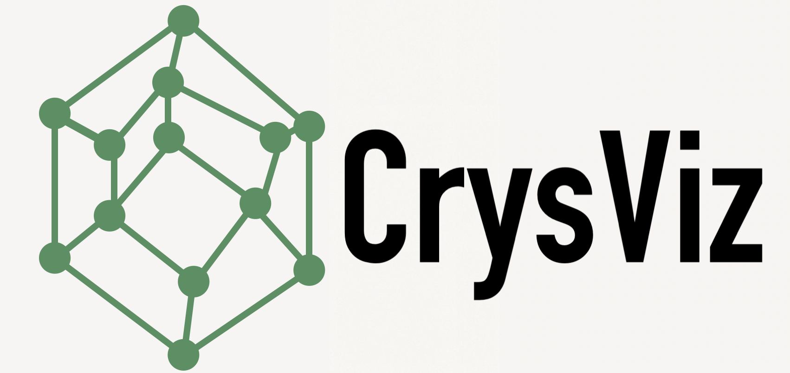

Light-weight browser-based visualisation of POSCAR files with on-device rendering. 

### Current Features:

- Fully running in browser with mobile device and touch support
- Automatic periodice boundary conditions
- Automatic visualisation of bonds with customisable maximum bond length values
- Inter-atomic distance measuring
- Angle measurements 🔥
- Periodic images outside the Unitcell
- Ability to remove atoms
- POSCAR works, CIFS (only if the symmetry is p1) and Optimade Structure URLS !!
- Choose your own colours 🔥

### Features We Could Add  
 
1. Switch for parallel vs. perspective view &#x2705;
2. Lighter shadow rendering &#x2705;
3. Checkbox to select and deselect individual bonds &#x2705;
4. Minimum bond length slider. Could be useful to identify ranges of bonds. 
5. Reset button for bond lengths, fix 0 bond length &#x2705; <- even though it says now "disabled", bonds are still shown  ❌
6. Keep distance measurements (last 3 or something) until clear &#x2705;
7. VESTA colors &#x2705; or some custom  map
8. Checkbox for "activating measuring" to be more touch compatible; so measuring is not enabled by default but needs a button click &#x2705;
9. Angle measurements &#x2705; Improve visualisation. &#x2705;
10. Show the metainfo line from poscar file
11. Option to create supercells with a limit of about 2000 atoms to not crash browser
12. Increaase line-width of dashed line along the currently measured distances. &#x2705;
13. When selecting the atoms for measuring the bonds, similar colors are used to mark the selection as for the atoms. Maybe we can find a better way to mark the atoms &#x2705;
14. Possibility to deselect atoms by clicking them again

### Possible Advanced Features 

1. On-the-fly symmetry information and potentially symmetrisation
2. Package as stand-alone offline application
 
