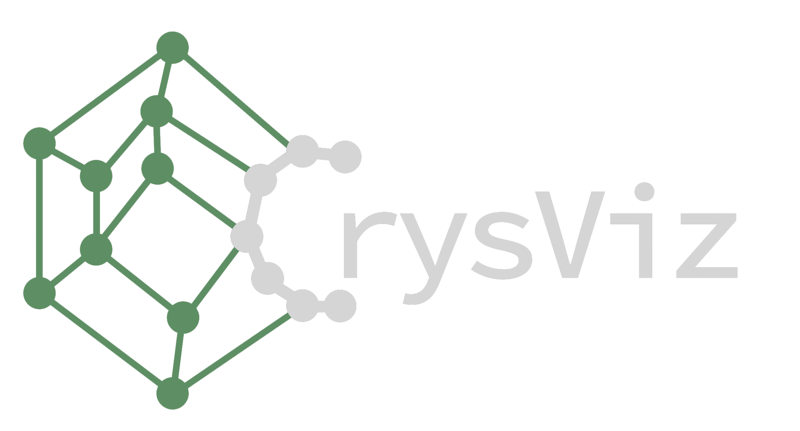

# Light-weight browser-based crystal structure visualisation with on-device rendering. 

## This is the live developement repository. If you are not Abhijith or Florian, you should not be here!

### Current Features:

- Fully running in browser with mobile device and touch support
- Automatic periodice boundary conditions
- Automatic visualisation of bonds with customisable maximum bond length values
- Inter-atomic distance measuring
- Angle measurements 
- Periodic images outside the Unitcell
- Ability to remove atoms
- read POSCAR, CIFS and load from Optimade Structure URLS 
- user colors for  individual atoms
- switch for parallel vs. perspective view 
- on-the-fly position and lattice chagnes

### Known Bugs & Problems
- choosing one atom for measurements and pushing clear button leads to highlight to be stuck <- seems to be fixed 
- zooming out on the website (ctrl + - )and the zooming the atoms crashes the atom view
- bonds need to be a tiny bit longer as there is a gap between atom and bonds <- seems to be fixed
- on high-res displays the bonds have a visible hexagonal shape. Is there a way to render them as tubes? <- seems to be fixed
- choosing an individual color for one atom does not change the color for the associated bonds <-  fixed 
- the "dot" on the species does not change the color if the color of an individual atom is changed  <-  fixed
- in the vesta-like colors a lot of elements are pink... colors need to be chosen somehow
- when a bond is measured and some color or position is changed, the measured bond switches to the periodic images
- - on bond lenght zero, even though it says now "disabled", bonds are still shown  

### Features We Could Add  
 
1. Minimum bond length slider. Could be useful to identify ranges of bonds.
2. VESTA color are not correct; or some custom  map
3. Show the metainfo line from poscar file
4. Option to create supercells with a limit of about 2000 atoms to not crash browser
5. Possibility to deselect single measurements by clicking them again
6. some comment under the upload stating that "No data leaves your device". Is this really true? 

### Possible Advanced Features 

1. On-the-fly symmetry information and potentially symmetrisation
2. Package as stand-alone offline application
4. Crystal Structure Comparison:
   - Mode (1): Compare structures by overlay. Option to load two structures that differ by a shade in color and a visualised on top of each other.  
   - Mode (2): Load two structures side by side. both can rotate on their own, but there is a button to lock them in the current state and then all roation is synced unless the button is pushed again
  
5. Magnetic Moment Visualisation:
  - Option (1): Load directly VASP output <- not sure we need that
  - Option (2): Add a second textbox at the end of the input where you can paste a list of N vectors that are added to the first N atoms.
 
